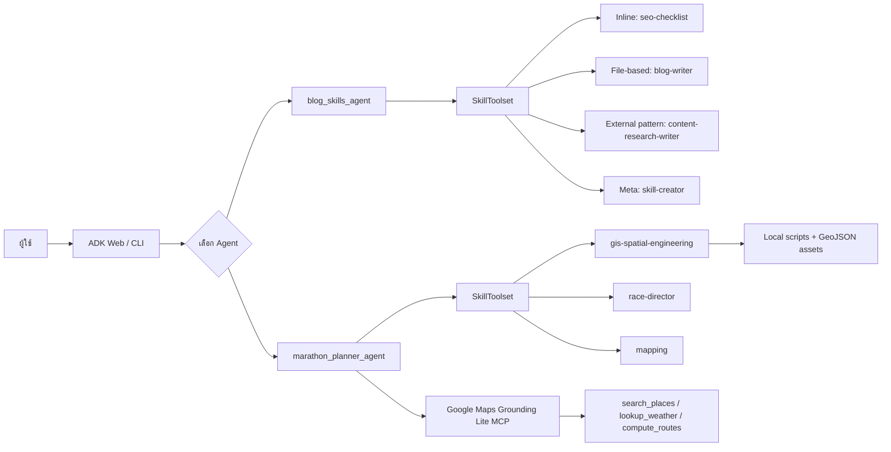
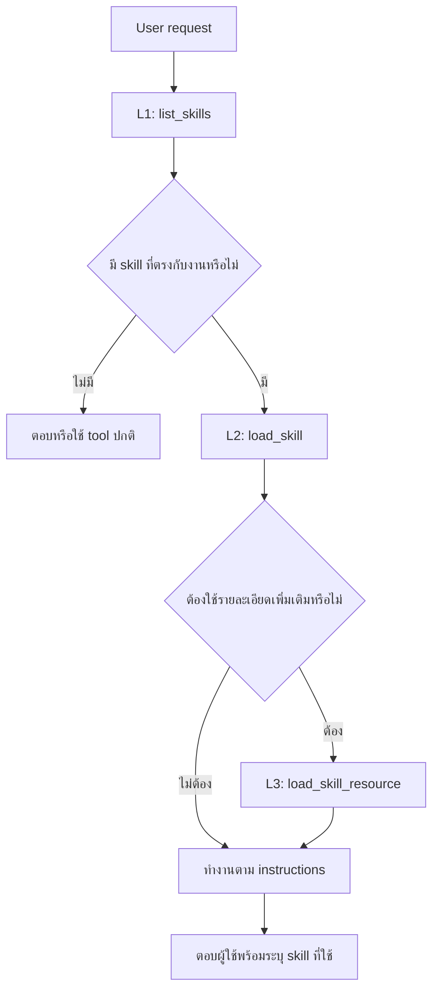
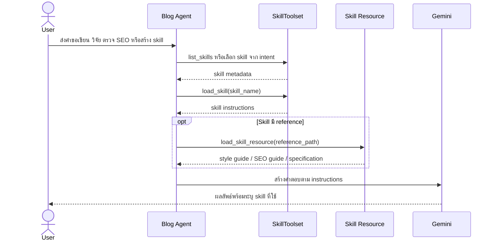
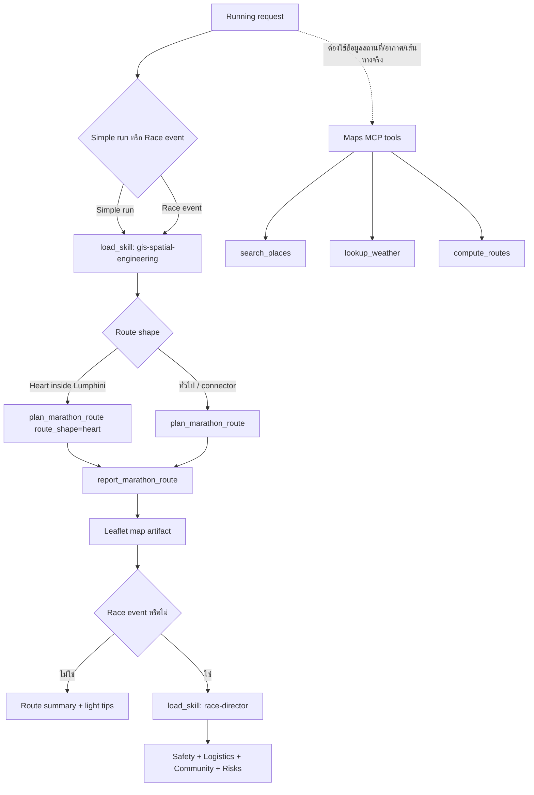

# ADK Skills PoC: Testing and Knowledge Guide

เอกสารนี้สรุปแนวคิด สถาปัตยกรรม วิธีทดสอบ ผลที่คาดหวัง และแนวทางตรวจสอบปัญหา
สำหรับ `blog_skills_agent` และ `marathon_planner_agent`

## Validation Status

| รายการ | ผลลัพธ์ |
|---|---|
| วันที่ทดสอบ | 2026-07-20 |
| Python | 3.12.6 |
| Google ADK | 1.35.2 |
| Google Gen AI SDK | 1.75.0 |
| Blog Skills Agent | Passed |
| Marathon Planner Agent | Passed |
| Local GIS route generation | Passed |
| Maps Grounding Lite MCP | Passed |
| ADK Web agent discovery | Passed: 2 agents |

ผลด้านบนเป็น manual smoke/integration test ใน development environment

## Architecture Overview



## ADK Skills Concepts

PoC นี้สาธิต progressive disclosure ซึ่งช่วยลด context ที่ส่งเข้า model โดยโหลดข้อมูล
เมื่อจำเป็นเท่านั้น



| ระดับ | Tool | หน้าที่ |
|---|---|---|
| L1 | `list_skills` | แสดง metadata เพื่อให้ agent รู้ว่ามี skill อะไร |
| L2 | `load_skill` | โหลด instructions ของ skill ที่ตรงกับคำขอ |
| L3 | `load_skill_resource` | โหลด references, assets หรือ scripts ที่ต้องใช้ |

## Prerequisites

รันคำสั่งจาก root ของ repository:

```bash
source .venv/bin/activate
pip install -r requirements.txt
```

root `.env` ต้องมีค่าพื้นฐาน:

```env
GOOGLE_GENAI_USE_VERTEXAI=FALSE
GEMINI_API_KEY=YOUR_GEMINI_API_KEY
MODEL_ID=gemini-2.5-flash
```

Maps Grounding Lite MCP ใช้ค่าเพิ่มเติม:

```env
GOOGLE_CLOUD_PROJECT=YOUR_PROJECT_ID
GOOGLE_CLOUD_LOCATION=global
GOOGLE_MAPS_API_KEY=YOUR_RESTRICTED_MAPS_API_KEY
```

ห้าม commit หรือบันทึก API key จริงในเอกสาร source control

## Start the PoC

```bash
adk web 8_agent_with_skill
```

เปิด `http://127.0.0.1:8000` และตรวจว่าพบเฉพาะ:

1. `blog_skills_agent`
2. `marathon_planner_agent`

ควรสร้าง New Session สำหรับแต่ละ test เพื่อไม่ให้ skill state หรือ conversation context
จาก test ก่อนหน้ามีผลกับผลลัพธ์

## Blog Skills Agent

### Expected Workflow



### Test Matrix

| Test | Prompt | Expected tools | Pass criteria |
|---|---|---|---|
| Skill discovery | `ตอนนี้คุณมี skills อะไรบ้าง` | `list_skills` | พบครบ 4 skills |
| Inline SEO | `ช่วยตรวจ SEO สำหรับบทความเริ่มต้นใช้ BigQuery AI` | `load_skill: seo-checklist` | มี title, meta, headings, keywords และ slug |
| File-based writer | `ใช้ blog-writer วาง outline เรื่อง Google ADK` | `load_skill`, `load_skill_resource: references/style-guide.md` | มี Hook, Context, Sections และ Takeaway |
| Research | `ใช้ content-research-writer วิจัย BigQuery AI` | `load_skill`, `load_skill_resource: references/seo-guidelines.md` | มี audience questions, keywords และ research plan |
| Multi-skill | `วิจัย วาง outline เขียนบทนำ และตรวจ SEO เรื่อง Google ADK` | Research + Writer + SEO | รวมคำแนะนำจากหลาย skills อย่างสอดคล้อง |
| Skill factory | `สร้าง SKILL.md ชื่อ python-security-review` | `load_skill: skill-creator` และ specification resources | ได้ YAML frontmatter และ actionable instructions |

### Skills Inventory

| Skill | Pattern | Resource |
|---|---|---|
| `seo-checklist` | Inline | Instructions อยู่ใน `agent.py` |
| `blog-writer` | File-based | `references/style-guide.md` |
| `content-research-writer` | External/community pattern | `references/seo-guidelines.md` |
| `skill-creator` | Meta/factory | Inline `skill-spec.md` และ `example-skill.md` |

### Blog Pass Checklist

- Agent โหลดเฉพาะ skill ที่เกี่ยวข้องกับคำขอ
- `blog-writer` อ่าน style guide ก่อนสร้างบทความ
- `content-research-writer` อ่าน SEO guidelines เมื่อจำเป็น
- `seo-checklist` ไม่เรียก resource ที่ไม่มีอยู่
- `skill-creator` สร้างชื่อแบบ kebab-case และมี YAML frontmatter
- Agent อธิบายว่าใช้ skill ใดและเพราะอะไร
- คำตอบเป็นภาษาเดียวกับผู้ใช้

## Marathon Planner Agent

### Decision and Tool Flow



### Test Matrix

| Test | Prompt | Expected tools | Pass criteria |
|---|---|---|---|
| Simple route | `ออกแบบเส้นทาง 5 กม. เริ่มและจบที่สวนลุมพินี` | `load_skill`, `plan_marathon_route`, `report_marathon_route` | มีระยะทาง จุดเริ่ม/จบ และ map artifact |
| Heart route | `เส้นทางรูปหัวใจในสวนลุมพินีเท่านั้น ระยะ 10 กม.` | GIS skill, `route_shape=heart`, report | เส้นทางอยู่ในสวนและอธิบายจำนวนรอบ |
| Park connector | `Run club 100 คน จากสวนลุมไปสวนเบญจกิติ` | GIS route tools; Maps MCP อาจถูกเรียก | กล่าวถึง connector และคำแนะนำเหมาะกับ 100 คน |
| Maps grounding | `ค้นหาจุดนัดพบใกล้สวนลุมและบอกอากาศวันนี้` | `search_places`, `lookup_weather` | ได้ข้อมูลจริง ไม่มี auth error |
| Race event | `วางแผนงานวิ่ง 5,000 คน ระยะ 10 กม.` | GIS + `race-director` + guide resource | ครบ safety, logistics, community, finance และ risks |
| Regeneration | `ขอเส้นทางใหม่ ระยะเท่าเดิมแต่ไม่ใช้เส้นทางเดิม` | เรียก `plan_marathon_route` ใหม่ | ได้ geometry/seed ใหม่ ไม่ตอบซ้ำจากข้อความเดิม |

### Simple Run versus Race Event

| พฤติกรรม | Simple run | Race event |
|---|---|---|
| GIS skill | Required | Required |
| Route map | Required | Required |
| Race director | ไม่ควรโหลด | Required |
| Wave starts | ไม่ต้องมี | ควรมีเมื่อเหมาะสม |
| Traffic/community plan | สั้นหรือไม่ต้องมี | Required |
| Financial viability | ไม่ต้องมี | Required |

### Marathon Pass Checklist

- ทุก route เรียก `report_marathon_route` หลังวางแผน
- แสดงระยะทางเป็นกิโลเมตร
- Simple run ไม่ถูกขยายเป็นแผนงานมาราธอนโดยไม่จำเป็น
- Race event ครอบคลุมหก quality pillars
- Heart route อยู่บนทางเดินในสวน ไม่ตัดผ่านทะเลสาบ
- แผนที่ artifact แสดงใน ADK Web
- Final response ไม่แสดง raw GeoJSON
- Maps MCP ไม่มี `401`, `403` หรือ `429`

## Observability

Telemetry settings ไม่ได้ควบคุมการเปิดหรือปิด Maps MCP การตั้งค่าเป็น `false`
เพียงป้องกันไม่ให้ส่ง agent traces/logs หรือ prompt/response ขึ้น Cloud

```env
GOOGLE_CLOUD_AGENT_ENGINE_ENABLE_TELEMETRY=false
OTEL_PYTHON_LOGGING_AUTO_INSTRUMENTATION_ENABLED=false
OTEL_INSTRUMENTATION_GENAI_CAPTURE_MESSAGE_CONTENT=false
ADK_CAPTURE_MESSAGE_CONTENT_IN_SPANS=false
```

| ต้องการดูอะไร | ตำแหน่ง |
|---|---|
| Agent/tool execution ในเครื่อง | ADK Web → Trace / Events |
| Python และ MCP errors | Terminal ที่รัน `adk web` |
| Maps request count และ errors | Google Cloud → APIs & Services → Maps Grounding Lite API → Metrics |
| Maps quota | Google Cloud → Maps Grounding Lite API → Quotas |
| Maps cost | Cloud Billing → Reports → กรอง Project/SKU |
| Cloud agent traces เมื่อเปิด telemetry | Google Cloud Trace Explorer |
| Cloud logs เมื่อเปิด telemetry | Logs Explorer |
| Agent Engine runtime metrics | Metrics Explorer → Reasoning Engine |

สำหรับ development ที่อาจมีข้อมูลบริษัท แนะนำให้คง message-content capture เป็น `false`

## Troubleshooting

### `Maps MCP tools disabled`

ตรวจว่า root `.env` มีค่าครบและ restart ADK Web:

```env
GOOGLE_CLOUD_PROJECT=YOUR_PROJECT_ID
GOOGLE_MAPS_API_KEY=YOUR_API_KEY
```

### HTTP 401 or invalid API key

- ตรวจว่า key ถูกคัดลอกครบ
- ตรวจว่าไม่มี quote หรือ whitespace ที่ไม่ต้องการ
- ตรวจว่า agent โหลด root `.env`

### HTTP 403 or service disabled

- เปิด `Maps Grounding Lite API` ใน project ที่กำหนดด้วย `GOOGLE_CLOUD_PROJECT`
- ตรวจว่า API restriction ของ key อนุญาต Maps Grounding Lite API
- ตรวจว่า Project มี Billing account ที่ active

### HTTP 429

- ตรวจ quota และ request rate
- รอ quota window reset
- ลดการทดสอบซ้ำหรือขอเพิ่ม quota ตามนโยบายบริษัท

### Skill ไม่ถูกโหลด

- เริ่ม New Session แล้วใช้ prompt ที่ระบุ intent ชัดเจน
- ตรวจชื่อใน YAML frontmatter ของ `SKILL.md`
- ตรวจว่า directory name ตรงกับ skill name
- เปิด ADK Web Trace เพื่อดู `list_skills` และ `load_skill`

### ไม่มี map artifact

- ตรวจว่ามี `report_marathon_route` หลัง `plan_marathon_route`
- เปิด Events/Trace เพื่อดู tool error
- ตรวจ permission ของ artifact/session storage หากไม่ได้ใช้ in-memory service

## Regression Checklist

ใช้รายการนี้หลังแก้ agent, prompt, skill หรือ dependency:

- [ ] `pip check` ไม่มี dependency conflict
- [ ] Python files compile ผ่าน
- [ ] ADK Web พบ 2 agents เท่านั้น
- [ ] Blog agent แสดงครบ 4 skills
- [ ] Blog file-based skills โหลด references ได้
- [ ] Skill creator สร้าง `SKILL.md` ที่ valid
- [ ] Marathon simple route สร้าง map artifact ได้
- [ ] Heart route อยู่ภายในสวนลุมพินี
- [ ] Race event โหลด `race-director`
- [ ] Maps MCP เรียก tools ได้โดยไม่มี auth error
- [ ] API key ไม่ปรากฏใน response, Trace หรือ committed files
- [ ] Final responses ไม่แสดง raw GeoJSON

## Key Takeaways

1. Skills แยก domain knowledge ออกจาก agent prompt และโหลดแบบ on demand
2. Progressive disclosure ช่วยลด context และทำให้ tool selection ชัดเจนขึ้น
3. References เหมาะกับ guideline ขนาดใหญ่ ส่วน scripts/assets เหมาะกับ deterministic work
4. Agent ควรแยก simple request กับ complex workflow ก่อนเลือก skills
5. Local ADK Trace เพียงพอสำหรับ development ส่วน Cloud telemetry เหมาะกับ shared production monitoring
6. Prompt/response telemetry ต้องพิจารณา PII, consent และนโยบายข้อมูลของบริษัทก่อนเปิดใช้งาน
