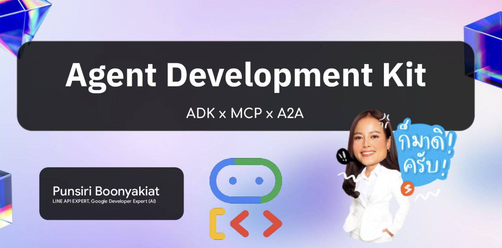

# Agent Development Kit x MCP x A2A

Instructor: Punsiri Boonyakiat

ตัวอย่างโปรเจกต์สาธิตการใช้งาน **Google Agent Development Kit (ADK)**
ใช้สำหรับสร้าง Agent, รวม Agent หลายตัว, และเชื่อมต่อกับ MCP Tools

## 📌 เนื้อหาหลัก Agent Development Kit (ADK) x MCP x A2A 🔥🔥

Slide: https://speakerdeck.com/punsiriboo/agent-development-kit-adk-x-mcp-x-a2a


1. Introduction to ADK
    * สร้าง AI Agents ด้วย Model, Goal, Instruction, Tools
    * Instruction Prompts คือหัวใจสำคัญ เพราะเป็นตัวกำหนดการทำงานของ AI Agent การเลือกเครื่องมือที่ถูกต้อง การทำงานให้ตรง scope
    * ทดสอบผ่าน adk web (Agent Simulator)
2. Connecting Agents to MCP Tools
    * Agent สามารมารถเรียกใช้เครื่องมือได้หลากหลาย
    * Tools: Built-in, 3rd-Party, Google Cloud, MCP, Open API
    * Airbnb MCP (Search, Listing) / LINE Bot MCP (Messaging API) 
    *  LINE Bot MCP ใช้ Channel Secret และ Access Token เชื่อมต่อ
3. Building Multi-Agent Systems
    * ข้อดี: Specialization, Scalability, Delegation, Robustness, Human Analogy
    * Workshop: ศึกษาโค้ด Multi-Agent และดูการส่งต่องาน
4. A2A Protocol (Agent-to-Agent)
    * แนวคิด: เหมือนส่งพนักงานไปทำงานข้ามบริษัท
    * เปิด Agent ออกสู่สาธารณะ เรียกใช้งานจากภายนอกได้
    * มี Agent Card (เหมือนเรซูเม่ หรือนามบัตรของ AI Agent) ให้ metadata ของ Agent เรียกใช้งาน

---

## โครงสร้างโฟลเดอร์

```
3_ADK/
├── 1_basic_agent/          # ตัวอย่างการสร้าง Agent แบบพื้นฐาน
├── 2_agent_with_mcp_tools/ # ตัวอย่าง Agent ที่เรียกใช้งาน MCP Tools ได้
├── 3_multi_agents/         # ตัวอย่างระบบ Multi-Agent (Manager + Sub-Agents)
├── 4_a2a/                  # ตัวอย่าง Agent-to-Agent (A2A) Interaction
└── README.md
```

---

## 1. Basic Agent

📂 `1_basic_agent`

* สาธิตการสร้าง Agent แบบง่าย ๆ ด้วย ADK
* ใช้เพียง **model** และ **instruction**
* เหมาะกับการเริ่มต้นเพื่อทำความเข้าใจโครงสร้าง Agent

---

## 2. Agent with MCP Tools

📂 `2_agent_with_mcp_tools`

* เพิ่มความสามารถให้ Agent สามารถเรียกใช้ **MCP Tools** ได้
* ตัวอย่าง: เรียก API ภายนอก, Query ข้อมูล หรือสั่งงานผ่าน Tool

---

## 3. Multi Agents

📂 `3_multi_agents`

* โชว์การสร้าง **Manager Agent (Router)**
* มี Sub-Agents เช่น:

  * `news_analyst` → วิเคราะห์ข่าว
  * `joke_agent` → เล่าเรื่องตลก
* Manager Agent จะรับข้อความ แล้วเลือก Sub-Agent ที่เหมาะสมในการทำงาน

### Flow Diagram

---

## 4. Agent-to-Agent (A2A)

📂 `4_a2a`

* สาธิตการที่ Agent คุย/ประสานงานกับ Agent อื่น ๆ โดยตรง (A2A interaction)
* ใช้ในเคสที่หลาย Agent ต้องทำงานร่วมกันแบบ collaborative

---

## วิธีการรัน

1. ติดตั้ง dependencies

   ```bash
   pip install -r requirements.txt
   ```

2. รันตัวอย่าง (เช่น multi-agents)

   ```bash
   python -m 3_ADK.3_multi_agents.main
   ```

---

## หมายเหตุ

* แต่ละโฟลเดอร์มีโค้ดตัวอย่างที่สามารถนำไปปรับใช้จริง
* เหมาะสำหรับ Developer ที่อยากเรียนรู้การสร้าง Agent ตั้งแต่ **Basic → Tools → Multi-Agent → Agent-to-Agent**

---

Enjoy building with **ADK** 🚀
