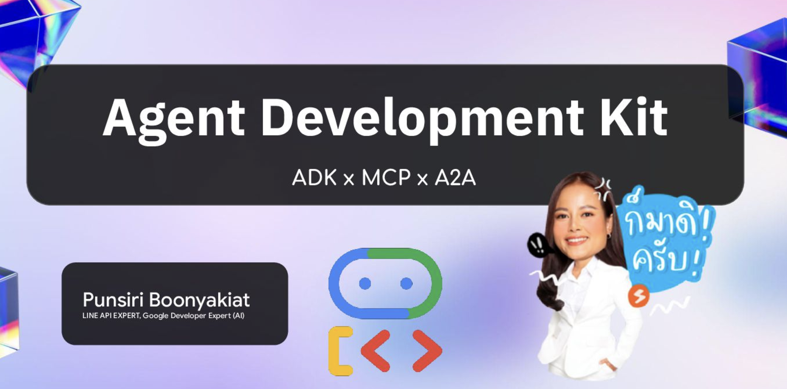
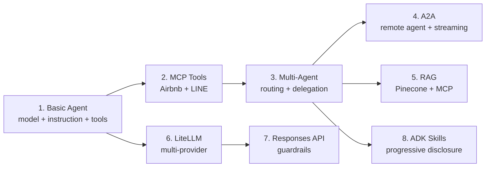
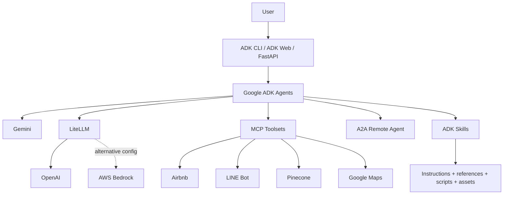

# ADK Agent Playground



Hands-on repository สำหรับทดลองสร้าง AI Agent ด้วย Google Agent Development Kit
(ADK) ตั้งแต่ agent พื้นฐาน ไปจนถึง MCP, multi-agent, A2A, RAG, LiteLLM,
OpenAI Responses API, safety guardrails และ ADK Skills

Repository นี้เริ่มจากการ fork
[`punsiriboo/adk-mcp-a2a-linebot-mcp-server`](https://github.com/punsiriboo/adk-mcp-a2a-linebot-mcp-server)
ของ Punsiri Boonyakiat แล้วพัฒนาต่อเป็น playground ส่วนตัว จึงมีทั้งตัวอย่างจาก workshop
และ PoC ที่เพิ่ม ทดลอง และปรับแก้ภายหลัง ไม่ได้เป็น mirror ของ upstream แบบตรงตัว

> สถานะโครงการ: learning lab / proof of concept โค้ดบางส่วนใช้ mock data,
> preview model หรือ external service และยังต้อง harden เพิ่มก่อนนำไปใช้ production

## สิ่งที่ต่อยอดใน Fork นี้

- เพิ่ม Pinecone RAG ที่ใช้ integrated embedding และเรียกค้นผ่าน MCP
- ทดลองเปลี่ยน model provider ผ่าน LiteLLM ทั้ง OpenAI และ AWS Bedrock
- เพิ่ม OpenAI Responses API พร้อม `before_agent_callback` และ
  `before_tool_callback` สำหรับ safety guardrails
- ทดลอง A2A streaming และ FastAPI SSE สำหรับส่ง event จาก remote agent
- เพิ่ม ADK Skills PoC จาก
  [`punsiriboo/adk-skills`](https://github.com/punsiriboo/adk-skills) ทั้ง Blog Skills
  และ Marathon Planner พร้อม GIS, Maps MCP และ map artifact
- รวม configuration หลักไว้ที่ root `.env` และเก็บเฉพาะตัวอย่างใน `.env.example`

## Learning Path

แต่ละโฟลเดอร์เป็น PoC แยกกัน แต่สามารถอ่านต่อเนื่องตามเส้นทางนี้ได้:


```mermaid
flowchart LR
    P1["1. Basic Agent<br/>model + instruction + tools"] --> P2["2. MCP Tools<br/>Airbnb + LINE"]
    P2 --> P3["3. Multi-Agent<br/>routing + delegation"]
    P3 --> P4["4. A2A<br/>remote agent + streaming"]
    P3 --> P5["5. RAG<br/>Pinecone + MCP"]
    P1 --> P6["6. LiteLLM<br/>multi-provider"]
    P6 --> P7["7. Responses API<br/>guardrails"]
    P3 --> P8["8. ADK Skills<br/>progressive disclosure"]
```

## PoC Catalog

| Folder | Agent / แนวคิดหลัก | Integration สำคัญ | เอกสาร |
|---|---|---|---|
| `1_basic_agent` | Neko Restaurant Agent: model, instruction และ Python function tools | Gemini | [README](1_basic_agent/README.md) |
| `2_agent_with_mcp_tools` | Travel Manager ค้นหาที่พักและส่งผลไป LINE | Airbnb MCP, LINE Bot MCP | [README](2_agent_with_mcp_tools/README.md) |
| `3_multi_agents` | Manager route งานไปยัง Law Analyst หรือ Joke Agent | ADK sub-agents, `AgentTool` | [Source](3_multi_agents/agent.py) |
| `4_a2a` | Local Assistant ติดต่อ Remote Travel Agent ผ่าน A2A | A2A, Airbnb MCP, streaming, FastAPI SSE | [Setup guide](4_a2a/README_SETUP.md) |
| `5_pinecone_rag_with_mcp_tools` | Sales Knowledge Assistant แบบ RAG | Pinecone integrated embedding, Pinecone MCP | [README](5_pinecone_rag_with_mcp_tools/README.md) |
| `6_basic_agent_litellm` | Neko Agent ที่สลับ provider ผ่าน LiteLLM | OpenAI, AWS Bedrock, optional LangSmith | [README](6_basic_agent_litellm/README.md) |
| `7_agent_litellm_response_openai` | OpenAI Responses API พร้อม scope และ tool guardrails | LiteLLM, OpenAI Responses API | [README](7_agent_litellm_response_openai/README.md) |
| `8_agent_with_skill` | Blog Skills Agent และ Marathon Planner Agent | ADK Skills, Maps Grounding Lite MCP, local GIS | [README](8_agent_with_skill/README.md) / [Testing guide](8_agent_with_skill/TESTING_GUIDE.md) |

## Integration Overview


```mermaid
flowchart TB
    User["User"] --> UI["ADK CLI / ADK Web / FastAPI"]
    UI --> ADK["Google ADK Agents"]

    ADK --> Gemini["Gemini"]
    ADK --> LiteLLM["LiteLLM"]
    LiteLLM --> OpenAI["OpenAI"]
    LiteLLM -. "alternative config" .-> Bedrock["AWS Bedrock"]

    ADK --> MCP["MCP Toolsets"]
    MCP --> Airbnb["Airbnb"]
    MCP --> Line["LINE Bot"]
    MCP --> Pinecone["Pinecone"]
    MCP --> Maps["Google Maps"]

    ADK --> A2A["A2A Remote Agent"]
    ADK --> Skills["ADK Skills"]
    Skills --> Resources["Instructions + references + scripts + assets"]
```

## Project Structure

```text
adk-mcp-a2a-linebot-mcp-server/
├── 1_basic_agent/                       # Agent + local function tools
├── 2_agent_with_mcp_tools/              # Airbnb and LINE MCP
├── 3_multi_agents/                      # Manager and specialist agents
├── 4_a2a/                               # Remote A2A + streaming experiments
├── 5_pinecone_rag_with_mcp_tools/       # RAG with integrated embedding
├── 6_basic_agent_litellm/               # LiteLLM provider experiments
├── 7_agent_litellm_response_openai/     # Responses API + guardrails
├── 8_agent_with_skill/                  # Blog and Marathon Skills agents
├── images/
├── .env.example                         # Environment variable template
├── requirements.txt                     # Shared Python dependencies
└── README.md
```

## Prerequisites

- Python 3.10 ขึ้นไป; environment ปัจจุบันทดสอบด้วย Python 3.12.6
- Node.js และ `npx` สำหรับ PoC ที่เปิด MCP server ผ่าน stdio
- API key หรือ cloud account เฉพาะ service ที่ต้องการทดสอบ
- Network access สำหรับดาวน์โหลด MCP package และเรียก external API

Shared environment ปัจจุบันใช้ Google ADK 1.35.2, Google Gen AI SDK 1.75.0,
LiteLLM 1.80.5 และ Pinecone SDK 8.0.0 เวอร์ชันที่ติดตั้งจริงอาจเปลี่ยนได้ตามช่วง
ที่กำหนดใน `requirements.txt`

## Setup

รันจาก root ของ repository:

```bash
python3 -m venv .venv
source .venv/bin/activate
python -m pip install --upgrade pip
pip install -r requirements.txt
```

ถ้ายังไม่มี root `.env` ให้สร้างจาก template แล้วใส่ค่าเฉพาะที่ต้องใช้:

```bash
cp .env.example .env
```

ค่าพื้นฐานสำหรับ Gemini agents:

```env
GOOGLE_GENAI_USE_VERTEXAI=FALSE
GEMINI_API_KEY=YOUR_GEMINI_API_KEY
MODEL_ID=gemini-2.5-flash
```

ห้าม commit API key, token หรือ cloud credential จริง ไฟล์ `.env` ถูก ignore ไว้แล้ว
ส่วน `.env.example` ต้องมีเพียงชื่อ variable และ placeholder เท่านั้น

### Environment Matrix

| PoC | Environment variables เพิ่มเติม | หมายเหตุ |
|---|---|---|
| 1, 3 | ใช้ Gemini configuration พื้นฐาน | Function tools และ sub-agents ทำงานใน process เดียว |
| 2 | `CHANNEL_ACCESS_TOKEN`, `DESTINATION_USER_ID` เมื่อต้องการใช้ LINE | ต้องมี Node.js; LINE tool ส่งข้อความจริงได้ |
| 4 | `GEMINI_API_KEY` สำหรับ remote agent | Remote A2A server เป็น process แยกและยังใช้ env/setup ภายในโฟลเดอร์ของตัวเอง |
| 5 | `PINECONE_API_KEY` | `create_index.py` และ `ingest_data.py` เปลี่ยนข้อมูลบน Pinecone จริง |
| 6 | `OPENAI_API_KEY`, `OPENAI_MODEL_ID` | Bedrock และ LangSmith เป็น configuration ทางเลือกใน `.env.example` |
| 7 | `OPENAI_API_KEY`, `OPENAI_MODEL_ID` | เรียก OpenAI Responses API ผ่าน LiteLLM |
| 8 Blog | Gemini configuration พื้นฐาน | โหลด `.env` จาก root โดยตรง |
| 8 Marathon | `GOOGLE_CLOUD_PROJECT`, `GOOGLE_CLOUD_LOCATION`, `GOOGLE_MAPS_API_KEY` | ถ้าไม่ตั้งค่า Maps MCP จะถูกปิด แต่ local GIS ยังทำงานได้ |

## Run

### Interactive CLI

ADK 1.35+ บังคับให้ `App.name` เป็น Python identifier แต่โฟลเดอร์ legacy ของ
PoC 1-7 ขึ้นต้นด้วยตัวเลข จึงไม่ควรส่งชื่อโฟลเดอร์เหล่านั้นให้ `adk run` โดยตรง
PoC 5 มี valid child app พร้อมใช้ตามคำสั่งในหัวข้อ Pinecone RAG ด้านล่าง ส่วน
PoC 1, 2, 3, 6 และ 7 ต้องเพิ่ม valid child app หรือเปลี่ยนชื่อก่อนใช้กับ ADK รุ่นนี้

### ADK Web

คำสั่งต่อไปนี้ใช้ดูรายการ directory ได้ แต่ไม่ควรเลือกโฟลเดอร์ PoC ที่ขึ้นต้นด้วย
ตัวเลข เพราะจะเกิด `Invalid app name`:

```bash
adk web .
```

ADK อาจแสดง directory อื่นที่ root ซึ่งไม่ใช่ agent เช่น `images` หรือ
`8_agent_with_skill`; อย่าเลือก directory เหล่านั้นจาก server ชุดนี้ และเปิด PoC 8
ด้วยคำสั่งเฉพาะด้านล่างแทน

PoC 8 เป็น agents directory ของตัวเองและมี 2 agents:

```bash
adk web 8_agent_with_skill
```

เปิด `http://127.0.0.1:8000` แล้วเลือก `blog_skills_agent` หรือ
`marathon_planner_agent` รายละเอียด prompt และ expected tool flow อยู่ใน
[`8_agent_with_skill/TESTING_GUIDE.md`](8_agent_with_skill/TESTING_GUIDE.md)

### Pinecone RAG

เตรียม index และ sample data ก่อนเปิด agent ครั้งแรก:

PoC 5 ใช้ virtual environment ของตัวเอง เนื่องจาก `McpToolset` กับ endpoint
`app-info` มี incompatibility ใน ADK 1.x แต่แก้แล้วใน ADK 2.x:

```bash
python3 -m venv 5_pinecone_rag_with_mcp_tools/.venv
source 5_pinecone_rag_with_mcp_tools/.venv/bin/activate
python -m pip install -r 5_pinecone_rag_with_mcp_tools/requirements.txt
```

> `create_index.py` ใช้ชื่อ index `test-rag-integrated` และอาจเสนอให้ลบ/recreate
> index เดิม ควรตรวจ account, project และชื่อ index ให้ถูกต้องก่อนยืนยัน

```bash
python 5_pinecone_rag_with_mcp_tools/create_index.py
python 5_pinecone_rag_with_mcp_tools/ingest_data.py
adk run 5_pinecone_rag_with_mcp_tools/pinecone_rag_agent
```

สำหรับ Web UI ให้เปิดโฟลเดอร์ PoC 5 เป็น agents directory เพื่อให้ ADK ใช้ชื่อ
`pinecone_rag_agent` ซึ่งเป็น Python identifier ที่ถูกต้อง:

```bash
adk web 5_pinecone_rag_with_mcp_tools
```

เปิด `http://127.0.0.1:8000` แล้วเลือก `pinecone_rag_agent` อย่าเลือกชื่อ
โฟลเดอร์ที่ขึ้นต้นด้วยตัวเลขจาก `adk web .` เพราะ ADK 1.35+ ไม่ยอมรับชื่อดังกล่าว
เป็น `App.name`

### A2A

PoC 4 ต้องเปิดอย่างน้อย 2 processes: Remote Travel Agent ที่ port `8001` และ
local client/UI ที่เชื่อมผ่าน agent card หากต้องการทดสอบ FastAPI SSE ให้เปิด process
ที่ port `8002` เพิ่มอีกตัว ดูลำดับ setup และข้อจำกัดที่
[`4_a2a/README_SETUP.md`](4_a2a/README_SETUP.md)

> PoC นี้เป็น historical/experimental setup: startup scripts ยังมี absolute path
> ของเครื่องผู้พัฒนา, remote environment ใช้ dependency ชุดเก่า และคู่มือบางส่วนใช้
> ADK CLI syntax รุ่นก่อน จึงควร revalidate compatibility ก่อนรันหรือย้ายเครื่อง

## Suggested Smoke Tests

| PoC | Prompt / สิ่งที่ควรตรวจ |
|---|---|
| 1 | `มีเมนูอาหารญี่ปุ่นอะไรบ้าง` แล้วตรวจว่าเรียก `find_menu_items` |
| 2 | ค้นหาที่พักตามเมือง วันที่ และจำนวนผู้เข้าพัก; ทดสอบ LINE เฉพาะ recipient ที่อนุญาต |
| 3 | ถามกฎหมายหนึ่งครั้งและขอมุกหนึ่งครั้ง เพื่อตรวจ routing ไปคนละ sub-agent |
| 5 | ถามเรื่องเทคนิคการขายและตรวจว่าคำตอบอ้างอิง context จาก Pinecone |
| 6 | เปรียบเทียบ verbosity/reasoning ของ model ที่ตั้งผ่าน LiteLLM |
| 7 | ทดสอบทั้งคำขอเกี่ยวกับร้านและคำขอนอก scope เพื่อดู guardrail callbacks |
| 8 | ใช้ test matrix ใน [Testing guide](8_agent_with_skill/TESTING_GUIDE.md) |

ตรวจ dependency และ syntax หลังแก้โค้ด:

```bash
pip check
python -m compileall -q -x '(^|/)(\.venv|__pycache__)/' \
  1_basic_agent 2_agent_with_mcp_tools 3_multi_agents 4_a2a \
  5_pinecone_rag_with_mcp_tools 6_basic_agent_litellm \
  7_agent_litellm_response_openai 8_agent_with_skill
```

### Validation Status

- PoC 8 ผ่าน manual smoke/integration test ทั้ง 2 agents, local GIS และ Maps MCP
  เมื่อ 2026-07-20 ดูรายละเอียดใน
  [`8_agent_with_skill/TESTING_GUIDE.md`](8_agent_with_skill/TESTING_GUIDE.md)
- Repository ยังไม่มี automated test suite ครอบคลุม PoC 1–7
- External integrations และ model IDs ควรทดสอบใหม่เมื่อเปลี่ยน dependency, credential,
  account policy หรือ provider configuration
- PoC 4 ต้องตรวจ compatibility แยก เพราะ remote requirements และ startup flow ต่างจาก
  shared environment ที่ root

## Observability

- ADK Web: ดู agent events, tool calls และ trace ของ session ในเครื่อง
- Terminal: ดู Python exception, MCP stdio และ authentication errors
- LangSmith: มี configuration เตรียมไว้ใน PoC 6 แต่ปิดไว้เป็นค่าเริ่มต้น
- Google Cloud Observability: PoC 8 รองรับ OpenTelemetry/Agent Engine settings;
  ดูรายละเอียดและ privacy trade-offs ใน
  [`8_agent_with_skill/TESTING_GUIDE.md`](8_agent_with_skill/TESTING_GUIDE.md)
- Provider console: ใช้ตรวจ API usage, quota, error rate และค่าใช้จ่ายของ Pinecone,
  OpenAI, AWS, LINE และ Google Maps

## Safety Notes

- `.adk/` ถูก ignore เพราะอาจมี prompt, session database และ generated artifacts;
  ให้ถือว่าเป็น local sensitive state และห้ามนำขึ้น source control
- PoC 2 สามารถส่ง LINE Flex Message ไปยัง `DESTINATION_USER_ID` จริง
- PoC 5 สามารถสร้าง index และ upsert records เข้า Pinecone จริง
- PoC 8 Marathon สามารถเรียก Google Maps API และใช้ quota/เกิดค่าใช้จ่ายได้
- PoC 4 FastAPI ไม่มี authentication หรือ rate limit และมี script ที่ bind `0.0.0.0`;
  ใช้เฉพาะ local/trusted network และห้าม expose สู่ production โดยตรง
- PoC 8 Marathon ใช้ `UnsafeLocalCodeExecutor` สำหรับ scripts ที่ bundle มากับ repository;
  ห้ามโหลด skill หรือ script จากแหล่งที่ไม่เชื่อถือ
- MCP packages ที่ใช้ `npx -y` จะถูกดาวน์โหลดและรันในเครื่อง ควรตรวจ package และ version
  ก่อนใช้ใน environment ที่เข้มงวด
- Function tools ในหลาย PoC คืนค่า mock เพื่อการเรียนรู้ ไม่ใช่ระบบ booking, cart หรือ
  legal advice จริง
- Guardrails ใน PoC 7 เป็นตัวอย่าง defense in depth ไม่ใช่ security boundary ที่สมบูรณ์

## Upstream and Credits

- Original fork:
  [`punsiriboo/adk-mcp-a2a-linebot-mcp-server`](https://github.com/punsiriboo/adk-mcp-a2a-linebot-mcp-server)
- Workshop slide:
  [Agent Development Kit (ADK) x MCP x A2A](https://speakerdeck.com/punsiriboo/agent-development-kit-adk-x-mcp-x-a2a)
- ADK Skills source:
  [`punsiriboo/adk-skills`](https://github.com/punsiriboo/adk-skills)
- PoC 8 source revision และ local integration changes:
  [`8_agent_with_skill/UPSTREAM.md`](8_agent_with_skill/UPSTREAM.md)

สร้างเพื่อเรียนรู้ ทดลอง และเปรียบเทียบรูปแบบการออกแบบ agent แบบลงมือทำจริง
